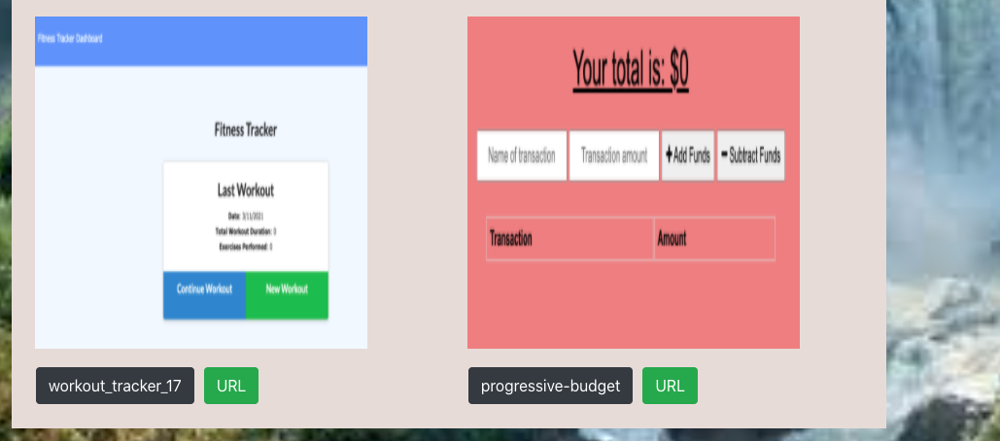

# React_Portfolio_19

## License
   

   # Table of Contents

   * [Description](#Description)

   * [Runing a command-line application ](#Runing-a-command-line-application) 

   * [Installation Instructions](#installation-instructions)
  
   * [Usage Instructions](#usage-instructions)
  
   * [Contribution](#Contribution)
  
   * [Developers Contact Information](#Developers-Contact-Information)

   * [License](#license)

   # Description

   * This is a react portfolio build by react Apps .
   * This application uses UI break in to components,Header,Footer, and manage component, and respond to user events and access to the information. 

   * I included in package.js as dependence
   * I created data.j to connect with my portfolio  to make dynamically.

   * npm install to a given dependence
   * package.js
   * react app package,
   * build,
   * gh-pages,
   * axios
   * BrowserRouter as Router

   * Acceptance Criteria.

   * users can quickly and easily loads the page, you will be get the option to search particularly helpful to be able to transfer by navbar.

   * View my portfolio  on the list page.

   #  Runing a command-line application 
 
   * You can View the stored database in a portfolio folder interms of data.js.

   * The app runs as a `npm start` to gather information about react Portfolio. 

   * My react_portfolio_20 web applications react app that is readable, reliable, and maintainable Oftentimes, node_modules,  main Readme, Screenshots.

   * I put my LinkedIn profile, my github URL repository, heroku url and email address working activly.

   ## Installation Instructions

   * The developer is authorizing a free installation by cloning from the repository code:- 

   * [destish21/react_portfolio_20](https://github.com/destish21/react_portfolio_20)

   * you can run by node `npm start` react_portfolio_20.

   # screenshot Image 1
   * 
   * 
   * 

   ## Usage Instructions
   ## To see my portfolio first Click home then you can see each of them
   * For this app to run make sure first:-

   * creat repository in your github, then clone the code from my github repository,

   * [destish21/react_portfolio_20](https://github.com/destish21/react_portfolio_20)

   * Install all necessary  node_moduales like all react packages, break up to components, and build etc.

   * Make sure every files imported and add axios gh-pages run by `npm i or npm install`
     in your computer.

   * Once in the directory run npm install to install the axios gh-pages needed to run the app.
    Run by  `npm start` in your computer command line.

   * A`react_portfolio_20
     App !!` will be desplayed after you run the see npm start !. 

   * It built with diferent package to connect to my deploy pages and perform requeries `gh-pages` file and return all files.

   * React app to interact with the user the command-line.

   * you can  quickly access to emails and GitHub profiles.

   * My `react_portfolio_20`
    is in my github repository enjoy it!
   * Screenshot Images 2
 
  
   * 
   * 
   * 
   * 
   * 
   * 
   * 
   * 

   
   ## Contribution

   * This is Contributed by [destish21/react_portfolio_20](https://github.com/destish21/react_portfolio_20). 
   
   * But Contribution, issues and feature requests are welcome.
   * Feel free to check issues page if you want to contribute. 
   * you can contact me by Contact Information here below.

 ## Developers Contact Information
   * LinkdIn Profile : [Desta Mulualem](https://www.linkedin.com/in/desta-mulualem-6718b1203/)
   * Deployed URL : https://destish21.github.io/react_portfolio_20/
   * github URL : https://github.com/destish21/react_portfolio_20
   * My ResumGoogleDocs Link: [Resume Link](https://docs.google.com/document/d/1kLc-bR0cb3ASljSuCPTRCOJI1B2KnBIMRpskvdM__WE/edit?usp=sharing)

   * Email : destish21@yahoo.com
   
   # Desta Mulualem. All Rights Reserved © 03/09/2021.

  ---

 ## Getting Started with Create React App

   This project was bootstrapped with [Create React App](https://github.com/facebook/create-react-app).

   ## Available Scripts

   In the project directory, you can run:

   ### `npm start`

   Runs the app in the development mode.\
   Open [http://localhost:3000](http://localhost:3000) to view it in the browser.

   The page will reload if you make edits.\
   You will also see any lint errors in the console.

   ### `npm test`

   Launches the test runner in the interactive watch mode.\
   See the section about [running tests](https://facebook.github.io/create-react-app/docs/running-tests) for more information.

   ### `npm run build`

   Builds the app for production to the `build` folder.\
   It correctly bundles React in production mode and optimizes the build for the best performance.

   The build is minified and the filenames include the hashes.\
   Your app is ready to be deployed!

   See the section about [deployment](https://facebook.github.io/create-react-app/docs/deployment) for more information.

   ### `npm run eject`

   **Note: this is a one-way operation. Once you `eject`, you can’t go back!**

   If you aren’t satisfied with the build tool and configuration choices, you can `eject` at any time. This command will remove the single build dependency from your project.

   Instead, it will copy all the configuration files and the transitive dependencies (webpack, Babel, ESLint, etc) right into your project so you have full control over them. All of the commands except `eject` will still work, but they will point to the copied scripts so you can tweak them. At this point you’re on your own.

   You don’t have to ever use `eject`. The curated feature set is suitable for small and middle deployments, and you shouldn’t feel obligated to use this feature. However we understand that this tool wouldn’t be useful if you couldn’t customize it when you are ready for it.

   ## Learn More

   You can learn more in the [Create React App documentation](https://facebook.github.io/create-react-app/docs/getting-started).

   To learn React, check out the [React documentation](https://reactjs.org/).

   ### Code Splitting

   This section has moved here: [https://facebook.github.io/create-react-app/docs/code-splitting](https://facebook.github.io/create-react-app/docs/code-splitting)

   ### Analyzing the Bundle Size

   This section has moved here: [https://facebook.github.io/create-react-app/docs/analyzing-the-bundle-size](https://facebook.github.io/create-react-app/docs/analyzing-the-bundle-size)

   ### Making a Progressive Web App

   This section has moved here: [https://facebook.github.io/create-react-app/docs/making-a-progressive-web-app](https://facebook.github.io/create-react-app/docs/making-a-progressive-web-app)

   ### Advanced Configuration

   This section has moved here: [https://facebook.github.io/create-react-app/docs/advanced-configuration](https://facebook.github.io/create-react-app/docs/advanced-configuration)

   ### Deployment

   This section has moved here: [https://facebook.github.io/create-react-app/docs/deployment](https://facebook.github.io/create-react-app/docs/deployment)

   ### `npm run build` fails to minify

   This section has moved here: [https://facebook.github.io/create-react-app/docs/troubleshooting#npm-run-build-fails-to-minify](https://facebook.github.io/create-react-app/docs/troubleshooting#npm-run-build-fails-to-minify)
